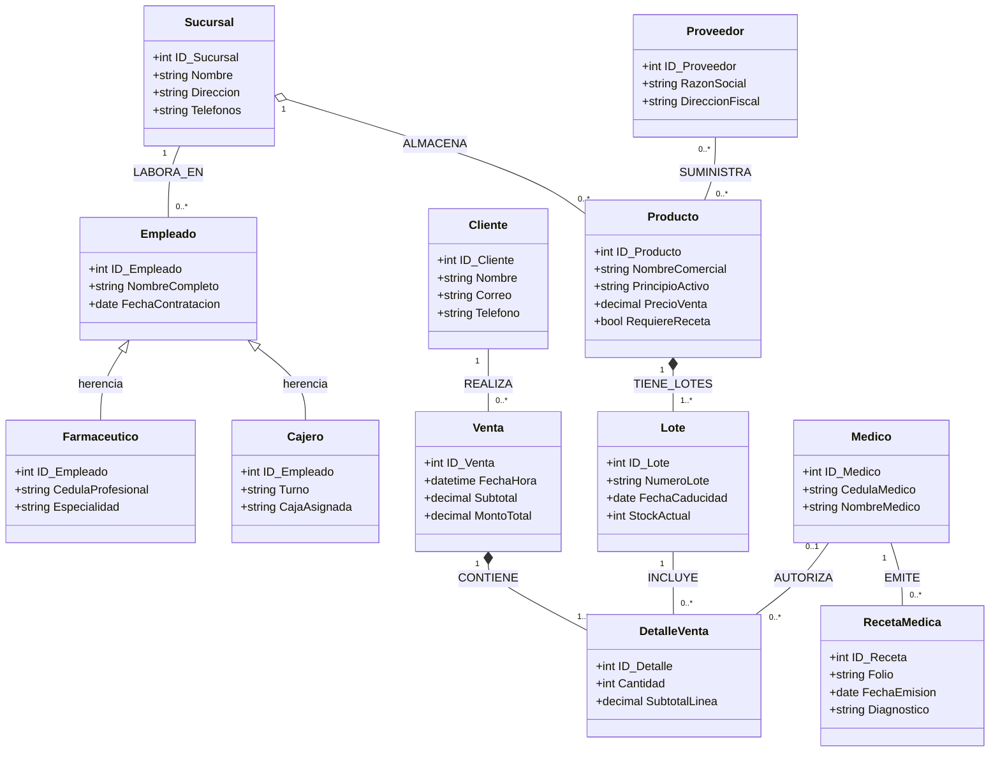

# Tarea 2.2: Diagrama de Clases UML - Sistema de farmacia

```mermaid
classDiagram
direction TB

class Sucursal {
    +int ID_Sucursal
    +string Nombre
    +string Direccion
    +string Telefonos
}

class Empleado {
    +int ID_Empleado
    +string NombreCompleto
    +date FechaContratacion
}

class Farmaceutico {
    +int ID_Empleado
    +string CedulaProfesional
    +string Especialidad
}

class Cajero {
    +int ID_Empleado
    +string Turno
    +string CajaAsignada
}

class Cliente {
    +int ID_Cliente
    +string Nombre
    +string Correo
    +string Telefono
}

class Medico {
    +int ID_Medico
    +string CedulaMedico
    +string NombreMedico
}

class Proveedor {
    +int ID_Proveedor
    +string RazonSocial
    +string DireccionFiscal
}

class Producto {
    +int ID_Producto
    +string NombreComercial
    +string PrincipioActivo
    +decimal PrecioVenta
    +bool RequiereReceta
}

class Lote {
    +int ID_Lote
    +string NumeroLote
    +date FechaCaducidad
    +int StockActual
}

class Venta {
    +int ID_Venta
    +datetime FechaHora
    +decimal Subtotal
    +decimal MontoTotal
}

class DetalleVenta {
    +int ID_Detalle
    +int Cantidad
    +decimal SubtotalLinea
}

class RecetaMedica {
    +int ID_Receta
    +string Folio
    +date FechaEmision
    +string Diagnostico
}

Empleado <|-- Farmaceutico : herencia
Empleado <|-- Cajero : herencia

Sucursal "1" -- "0..*" Empleado : LABORA_EN
Sucursal "1" o-- "0..*" Producto : ALMACENA

Proveedor "0..*" -- "0..*" Producto : SUMINISTRA

Producto "1" *-- "1..*" Lote : TIENE_LOTES

Cliente "1" -- "0..*" Venta : REALIZA

Venta "1" *-- "1..*" DetalleVenta : CONTIENE

Lote "1" -- "0..*" DetalleVenta : INCLUYE

Medico "1" -- "0..*" RecetaMedica : EMITE

Medico "0..1" -- "0..*" DetalleVenta : AUTORIZA
```

