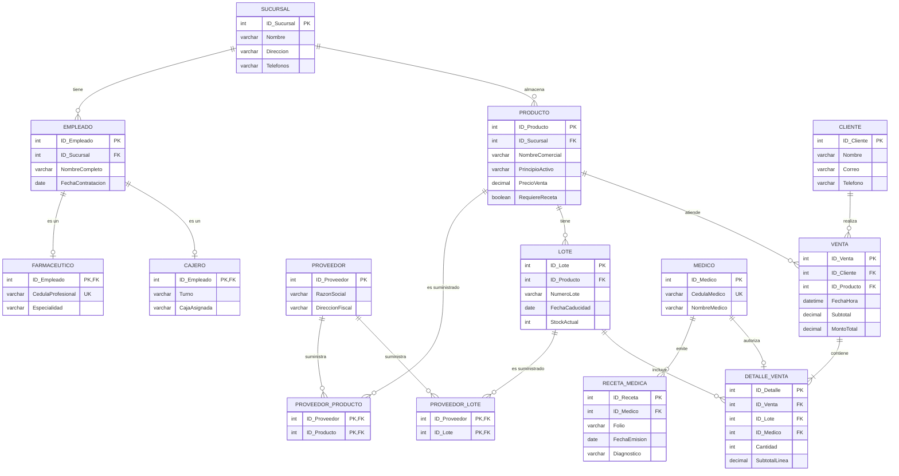

## Diagrama del esquema relacional – Farmacia

```mermaid
erDiagram

    SUCURSAL {
        int ID_Sucursal PK
        varchar Nombre
        varchar Direccion
        varchar Telefonos
    }

    EMPLEADO {
        int ID_Empleado PK
        int ID_Sucursal FK
        varchar NombreCompleto
        date FechaContratacion
    }

    FARMACEUTICO {
        int ID_Empleado PK, FK
        varchar CedulaProfesional UK
        varchar Especialidad
    }

    CAJERO {
        int ID_Empleado PK, FK
        varchar Turno
        varchar CajaAsignada
    }

    PRODUCTO {
        int ID_Producto PK
        int ID_Sucursal FK
        varchar NombreComercial
        varchar PrincipioActivo
        decimal PrecioVenta
        boolean RequiereReceta
    }

    PROVEEDOR {
        int ID_Proveedor PK
        varchar RazonSocial
        varchar DireccionFiscal
    }

    PROVEEDOR_PRODUCTO {
        int ID_Proveedor PK, FK
        int ID_Producto PK, FK
    }

    LOTE {
        int ID_Lote PK
        int ID_Producto FK
        varchar NumeroLote
        date FechaCaducidad
        int StockActual
    }

    PROVEEDOR_LOTE {
        int ID_Proveedor PK, FK
        int ID_Lote PK, FK
    }

    CLIENTE {
        int ID_Cliente PK
        varchar Nombre
        varchar Correo
        varchar Telefono
    }

    VENTA {
        int ID_Venta PK
        int ID_Cliente FK
        int ID_Producto FK
        datetime FechaHora
        decimal Subtotal
        decimal MontoTotal
    }

    DETALLE_VENTA {
        int ID_Detalle PK
        int ID_Venta FK
        int ID_Lote FK
        int ID_Medico FK
        int Cantidad
        decimal SubtotalLinea
    }

    MEDICO {
        int ID_Medico PK
        varchar CedulaMedico UK
        varchar NombreMedico
    }

    RECETA_MEDICA {
        int ID_Receta PK
        int ID_Medico FK
        varchar Folio
        date FechaEmision
        varchar Diagnostico
    }

    %% Relaciones de sucursales

    SUCURSAL ||--o{ EMPLEADO : "tiene"
    SUCURSAL ||--o{ PRODUCTO : "almacena"

    %% Jerarquia de empleados

    EMPLEADO ||--o| FARMACEUTICO : "es un"
    EMPLEADO ||--o| CAJERO : "es un"

    %% Relaciones de proveedores y productos

    PROVEEDOR ||--o{ PROVEEDOR_PRODUCTO : "suministra"
    PRODUCTO ||--o{ PROVEEDOR_PRODUCTO : "es suministrado"

    %% Relaciones de productos y lotes

    PRODUCTO ||--o{ LOTE : "tiene"

    PROVEEDOR ||--o{ PROVEEDOR_LOTE : "suministra"
    LOTE ||--o{ PROVEEDOR_LOTE : "es suministrado"

    %% Relaciones de clientes y ventas

    CLIENTE ||--o{ VENTA : "realiza"
    PRODUCTO ||--o{ VENTA : "atiende"

    %% Relaciones de ventas y detalles

    VENTA ||--|{ DETALLE_VENTA : "contiene"
    LOTE ||--o{ DETALLE_VENTA : "incluye"

    %% Relaciones de medicos y recetas

    MEDICO ||--o{ RECETA_MEDICA : "emite"

    %% Autorizacion medica

    MEDICO ||--o| DETALLE_VENTA : "autoriza"
```
